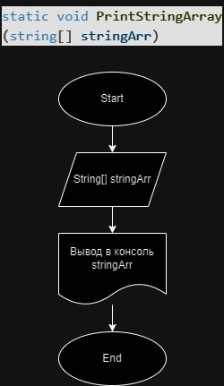

# Итоговая контрольная работа

## Задание
Написать программу, которая из имеющегося массива строк формирует новый массив из строк, длина которых меньше, либо равна 3 символам. Первоначальный массив можно ввести с клавиатуры, либо задать на старте выполнения алгоритма. При решении не рекомендуется пользоваться коллекциями, лучше обойтись исключительно массивами.

Примеры:
[“Hello”, “2”, “world”, “:-)”] → [“2”, “:-)”]

[“1234”, “1567”, “-2”, “computer science”] → [“-2”]

[“Russia”, “Denmark”, “Kazan”] → []

## Структура программы, метод Main

Программа состоит из основного метода Main, в котором последовательно происходит вызов методов:

1. Ввод массива строк с экрана.
```C#
string[] inStrings = InputStringArray("Введите строки через запятую", ',');
```
2. Выбор строк с длиной меньше или равно 3 символов и запись в другой массив.
```C#
string[] outStrings = SelectLenghtLessN(inStrings, 3);
```
3. Вывод массива строк на экран
```C#
PrintStringArray(outStrings);
```
Блок схема метода Main приведена ниже:


## Ввод массива с экрана. Метод InputStringArray.
Метод читает с экрана строку, разбивает ее на подстроки и записывает их в массив, который возвращается методом.

Ниже представлен его листинг и блок-схема:
```C#
static string[] InputStringArray(string message, char splitter)
    {
        Console.WriteLine(message);
        string? inputString = Console.ReadLine();
        return inputString.Split(splitter);

    }
```


## Отбор строк, длинной не более N символа, из массива. Метод SelectLenghtLessN
В методе на ввод подается массив строк stringArr и максималное число символов N. Далее создается пустой массив outStringArr и в него в цикле из stringArr записываютса только те строки длина который не более N.
Листинг и блок-схема ниже:
```C#
static string[] SelectLenghtLessN(string[] stringArr, int N)
    {
        string[] outStringArr = Array.Empty<string>();
        for (int i = 0; i < stringArr.Length; i++)
        {
            if (stringArr[i].Length <= N)
                outStringArr = outStringArr.Append(stringArr[i]).ToArray();
        }
        return outStringArr;
    }
```


## Вывод массива на печать. Метод PrintStringArray.
Метод принимает на вход массив строк stringArr, формирует из него строку вывода с помощью метода "Join" с использованием разделителя ", " и выводит строку на экран.
Ниже листинг и блок-схема.
```C#
static void PrintStringArray(string[] stringArr)
    {
        Console.WriteLine(string.Join(", ", stringArr));
    }
```


## Вывод 
Программа написана, блок схемы составлены, Readme написан.